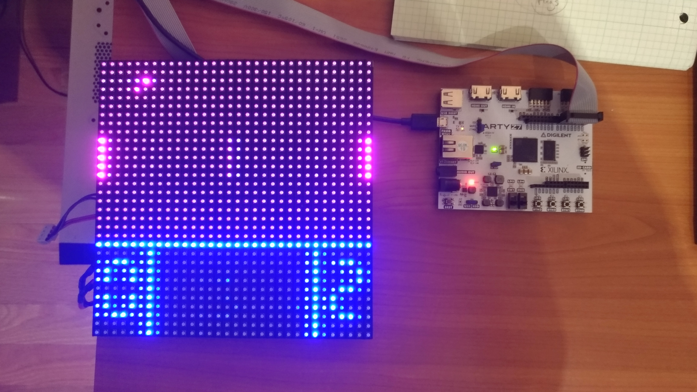
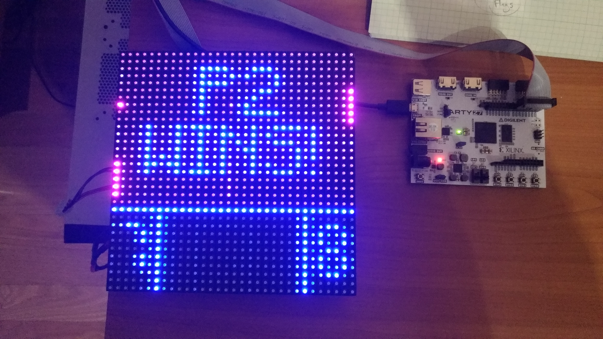

# Pong

My first FPGA project utilizing the SoC processor in conjunction with the programmable logic fabric.
Implements arcade game Pong on an Artix-7 Zynq FPGA and displays the graphics on a 32x32 RGB LED Matrix.
The microprocessor handles the game logic and graphics generation while the programmable logic handles the display output to RGB LED display.

Youtube Video Demo: https://www.youtube.com/watch?v=kSF9BcSRgo0&feature=youtu.be

Pictures:

